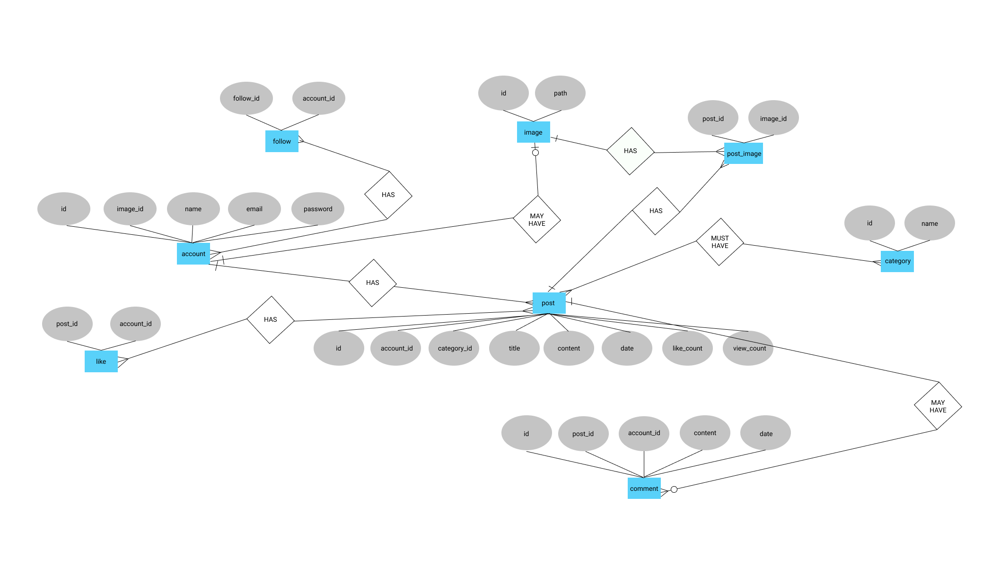

## CSS 348 - Advanced Database Management Systems

# **influence**

Influence is a community publishing platform, willfully blurring the lines between blogging and social networking. This is a web application.
It is home to a wide array of creative individuals looking to share common interests, meet new friends, and express themselves.
Our product will empower people to share ideas, offer support and make a difference.
We want to help them learn, work, communicate and have fun.

Influence encourages communal interaction and personal expression by offering a user-friendly interface and a deeply customizable blog system.
The service's individuality stems from the way highly dedicated users utilize our simple tools, along with the instinct for individual expression, to create new venues for online socializing.

With topics like politics, entertainment, fashion, literature and design, some key similarities emerge: the overall culture is distinctly open source-not only from a product perspective-but from a cultural one. The spirit of volunteerism pervades Influence, crossing all boundaries and propagated via insanely passionate individuals. At Influence creativity, diversity and tolerance are the mainstream.

***

### Our Principles:

#### Self-Expression
Our tools allow our user community to communicate with each other in immediate and creative ways. We believe in letting our users create their own content, to choose how they express themselves, their thoughts, and their feelings.

#### Diversity
We welcome and respect different opinions, different cultures, and different perspectives, and are committed to helping our users share their diversity with others. LiveJournal brings people of various backgrounds together, and strongly supports freedom of expression.

#### Creativity
We encourage our user community to use Influence to share the process of creating their content with friends. We believe that everyone has something to offer, whatever form it may take, and want to make it easy for our users to share that with the world.

#### Community
Influence thrives because of loyal users and active community volunteers. We're committed to collaborating with the community in order to improve the service for everyone, so we work to incorporate member feedback into our product and technical decisions. The Influence community enjoys an unprecedented amount of inspiration and input into product and policy decisions.

#### Privacy
We make sure to safeguard our users' private blog entries but also provide tools that allow them to choose with whom to share the content they want to share, be it with just a small group of friends, or with a larger user-created community. We respect the decisions our users make, and let them decide how to protect the content they create. We continue to maintain the service that the Influence community trusts.

***

<h2 id="functions-and-features">Functions and Features</h2>

- Reader-friendly interface

- Authorization / Registration

- Categories

- Views

- Likes

- Comments

- Search

- Post

- Follow

***

## Technologies

### **User interface**

We are going to build a full web application.

Advantages:
Reaching a Wider Audience  
The first and perhaps most obvious advantage of a website is the potential for reaching a wider audience. The internet is used by literally millions of people, all of them are looking for something and some of them might be looking for you!

Anyone, Anywhere & Anytime  
An advantage of having a website is your valuable information and details about your products and services can be accessed by anyone, no matter where they are on the planet or what time of day it is.

Easy Access To Information  
With a website, users can easily access information about your business. They can see what products or services you sell, your prices, your location and much more. Whatever you decide to tell them, they can find it with a few clicks of a mouse.

 

### Programming language: **Python**

### **⚜ Flask**

Flask is a lightweight Web Server Gateway Interface (WSGI) web application framework.

A micro web framework that has minimal dependencies on external libraries, written in Python, which was formed for a faster and easier use, and also has the ability to scale up to complex applications.

**Why Flask?**

Flask is considered the best framework for light web application serving, it is a lightweight framework and can also be useful to the developer if he or she chooses a web interface to the default system based UI.

**It is very flexible and easy.**

There are only a handful of parts of flask that cannot be changed or altered because of its simplicity and minimalism. This means that almost all the parts of flask are open to change, unlike some other web frameworks.

Flask comes with a template engine that lets you use the same user interface for multiple pages. Python can insert variables into the templates.

**Fully loaded.**

Flask includes dozens of extras you can use to handle common Web development tasks. Flask takes care of user authentication, routing, site maps, RSS feeds, and many more tasks — right out of the box.

**Reassuringly secure.**

Flask takes security seriously and helps developers avoid many common security mistakes, such as SQL injection, cross-site scripting, cross-site request forgery and clickjacking. Its user authentication system provides a secure way to manage user accounts and passwords.

**Exceedingly scalable.**

Some of the busiest sites on the planet use Flask’s ability to quickly and flexibly scale to meet the heaviest traffic demands.

**Incredibly versatile.**

Companies, organizations and governments have used Flask to build all sorts of things — from content management systems to social networks to scientific computing platforms.

**Modular and extremely comprehensive.**

Flask has a lightweight and modular design, so it easy to transform it to the web framework you need with a few extensions without weighing it down.

 

### Database: SQL

### **♔ SQLite**

**What Is SQLite?**

SQLite is a C-language library that implements a small, fast, self-contained, high-reliability, full-featured, SQL database engine. SQLite is the most used database engine in the world. SQLite is built into all mobile phones and most computers and comes bundled inside countless other applications that people use every day.

The SQLite file format is stable, cross-platform, and backwards compatible. SQLite database files are commonly used as containers to transfer rich content between systems and as a long-term archival format for data. There are over 1 trillion SQLite databases in active use.

SQLite source code is in the public-domain and is free to everyone to use for any purpose.

SQLite emphasizes economy, efficiency, reliability, independence, and simplicity.

Situations Where SQLite Works Well:

- Server-side database

- Websites

- File archive and/or data container

- Cache

- Data analysis

- Embedded devices and the IOT

***

## Questions

1. Find comments which have less than 10 words in content and where owner post's title starts with "M" letter and which was published more than 15,000 hours ago. 

We must to join posts table with comments and output comment id with filtering it by comment's content word count and post's title and by time, using julianday function subtracting now date with post created date and multipkying by 24. Then, select comment's id as output.  

2. List authors by their popularity(amount of followers, likes and comments)

Join five tables aacounts, subscriptions, posts, likes, comments. Then, order the result by counts of subscriptions, likes, comments and select account's name.

3. How many posts, which title starts with "A" and published no earlier than one week and have more than 35 likes, have an author, which have more than 10 followings.

Let's start from joining all necesarry tables: accounts, subscriptions, posts, likes. After, filter the result by count of followings and post title by letter and by using julianday function check for needed time, by count of likes. Then, select count of posts.  

4. Find the name of the accounts and the number of their subscribers who has an avatar image and has at least one subscriber, and that is the author of the post, from the category science and in the title of which there is the word "white". List the output by follower amount in descending order.

By joining accounts, images, subscriptions, posts, categories tables we will get large information, let's filter it by follower quantity by counting following_id and post title by the word "white" and by science category. Then, output account name and follower quantity. 

5. Find a post that is more than 3 years old and which has more than three comments and at least 2 images and category is IT or music and which the author liked his own publication. List the output by comment amount in descending order.

After joining comments, categories, postImages, likes and posts filter it by julianday function substracting now date with post created date, dividing by 365. After, filter it by IT or music categories and post images amount and comments quantity with descending order by comment amount. Then, select post id as output. 

6. Can a owner of posts see a owner of a like? Display Post ID and a name of a owner of a like. Posts from Account#03880's posts.

Yes, their can. Each post joins with “like” and “accounts” tables. If some account puts like to post, the account’s “account_id” and the post’s “post_id” save in the “like” table. Thus, giving access to maintain the ownership of the like.

7. How do categories switch? Display a name_of_a_post_owner and a post_ID of the accounts where Account#06103 follows, as well as a post category - sport.

Every category has its own id, and every category name in the navigation bar in its own links have something like id. Every time, when the account selects a category, the feed changes the category id, and of course, posts. Because the “post” table joins with the “category” table by “category_id”.

8. Display a name_of_a_owner_of_a_like and ID of other posts that this owner of a like of a post with ID 2077 liked.

First, we take all the account IDs that liked the post ID 2077, and in the likes table, we iterate over the other post IDs of the users who liked the post ID 2077, except for the same post ID 2077.

9. If I don't like a user, how can I unsubscribe from him?

To do this operation, you must be logged in, then in the subscriber's department unsubscribe the account that you selected, if everything is successful, this account will be removed from your subscribers.

10. Display a owner of a post and followers of a owner of a post with ID 6862, if a length of a category name is greater than 6.

First join the "posts", "categories", "accounts", "subscriptions" tables.
Find a owner of a post, then from accounts, select an account name, where the account ID is the follower of a post owner if  post ID 6862 and the category name length is greater than 6.

11. Display account name, post number and average like number for each account with more than 5 followers, if that account has an post.

First, we find accounts with more than 5 subscribers, join posts and accounts, and then we group a accounts and find the number of posts and the average number of likes for all posts for the account, if there are any post in it.

12. How works the rendering of the post?

First things first, when a post renders on the site, it requires some pieces of information from “account”, “like”, “comment”, “image”, “image_post” and also, “category” tables. A server takes the account name, avatar and category name, date, title, content, like’s amount, amount of view and finally, comments of the post and puts them together.

13. How do categories switch?

Every category has its own id, and every category name in the navigation bar in its own links have something like id. Every time, when the account selects a category, the feed changes the category id, and of course, posts. Because the “post” table joins with the “category” table by “category_id”.

14. How many likes does the post have, with categories name’s length is more than 4, and who are its owners?

To do this, we will join the "like" table with “post” and “account”, “category”. Find posts with categories name’s length more than 4, and in order to see the number of likes, we can check the “post.like_count” value. Then, output “post.like_count” value,  the column “like.account_id” value.
 
15. Is the commentator of the post that has a couple of pictures liked the post and is he the follower of the author? If yes output the name of the commentator.

We will join tables “comments”, “post”, “account”, “follow” and “postImage”. Then, If the value of “post.title” is “Golden Park” and If the commentator id exists in the “like.account_id” column, and If the commentator id exists in the “follow_id” output name of the commentator.

16. Is the subscriber the author of a post that has more than 30 likes, and the category name length is more than 4, and the number of images of the post is more than one? If yes, output subscriber name.

For this question, we must join the “follow”, “post”, “category”, “postImage” tables. After that, if in the table "follow" the account's id exists and in the "post" table if its id exists in "post.account_id" and the value of "post.like_counter" is more than 30, If the length of "category.name" is more than 4 and finally, count the rows in the table "postImage", if the count is more than one, output the name of the subscriber.

17. Find the name of the account that left comments in November last year on the publication called "Player of the Year", which is among those who put a like, there is a user named "Ivan"

To solve this problem, we need to join the tables "account", "comment", "post", "like". After, find comments that left the account in November last year by checking the value of “comment.date” column. Then, find if exists a post named “Player of the Year” and via “like” table, a check is there an owner named "Ivan", output the account name.

***

## Link to a dataset for the project:
https://drive.google.com/drive/folders/1JFoSSLcWD-iCh6jkggGZKUH9WsSo9pL4?usp=sharing

***

## Table structures

<pre>
accounts (
    id INTEGER PRIMARY KEY AUTOINCREMENT,
    name VARCHAR(255) NOT NULL,
    email VARCHAR(255) NOT NULL UNIQUE,
    password TEXT NOT NULL,
    image_id INTEGER
);

posts (
    id INTEGER PRIMARY KEY AUTOINCREMENT,
    account_id INTEGER NOT NULL,
    category_id INTEGER,
    title VARCHAR(255) NOT NULL,
    content TEXT,
    created_date DATETIME DEFAULT current_timestamp,
    like_count INTEGER DEFAULT 0,
    view_count INTEGER DEFAULT 0
);

comments (
    id INTEGER PRIMARY KEY AUTOINCREMENT,
    post_id INTEGER NOT NULL,
    account_id INTEGER NOT NULL,
    content TEXT NOT NULL,
    added_date DATETIME DEFAULT current_timestamp
);

categories (
    id INTEGER PRIMARY KEY AUTOINCREMENT,
    name VARCHAR(255) NOT NULL UNIQUE
);

images (
    id INTEGER PRIMARY KEY AUTOINCREMENT,
    path TEXT NOT NULL
);

likes (
    post_id INTEGER NOT NULL,
    account_id INTEGER NOT NULL
);

subscriptions (
    follower_id INTEGER NOT NULL,
    author_id INTEGER NOT NULL
);

postimages (
    post_id INTEGER NOT NULL,
    image_id INTEGER NOT NULL
);
</pre>

***

## Use-case diagram

***

## Explanation of design decisions
 
* The relationship between **follower** and **account** is many to many because one user can have multiple followers. One follower can have multiple followed users.
* The relationship between **image** and **account** is one-to-zero-or-one relationship because when a primary key of image table becomes PK & FK in account table. 
* The relationship between **account** and **post** is one-to-many relationship because one record in account table can be associated with one or more records in post table. For example, each account can have many posts.
* The relationship between **post** and **like** is one-to-many relationship because one record in post table can be associated with one or more records in like table. For example, each post can have many likes.
* The relationship between **post** and **comment** is one-to-zero-or-many because one record in post table can be associated with no record or many records. For example, each post can have zero comments or many comments.
* The relationship between **category** and **post** is many-to-many relationship because one category can have multiple posts. One post can have multiple categories.
* The relationship between **post** and **post_image** is one-to-many relationship because one record in post table can be associated with one or more records in post_image table. For example, each post can have many images.
* The relationship between **image** and **post_image** is one-to-many relationship because one record in image table can be associated with one or more records in post_image table.

***
## ER diagram

***
## SQL project queries

SELECT 
                p.id id, i.id image_id, i.path image_path, 
                a.name account_name, c.name category_name, 
                p.title, p.content, 
                p.created_date created_date, 
                p.like_count, p.view_count 
            FROM posts p, accounts a, categories c
            LEFT JOIN postimages pi ON pi.post_id = p.id 
            LEFT JOIN images i ON pi.image_id = i.id 
            LEFT JOIN subscriptions s ON p.account_id=s.author_id
            WHERE p.account_id=a.id 
            AND p.category_id=c.id 
            AND (
                p.account_id=? 
                OR 
                p.account_id IN (SELECT author_id FROM subscriptions WHERE follower_id=?)
            )
            GROUP BY p.id
            ORDER BY p.id DESC
            LIMIT ? OFFSET ?
